Instead of having all these images on the README file, I have decided to link to here to showcase what the starter project looks like...

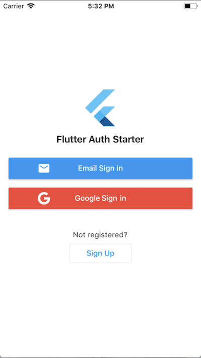

Splash Screen

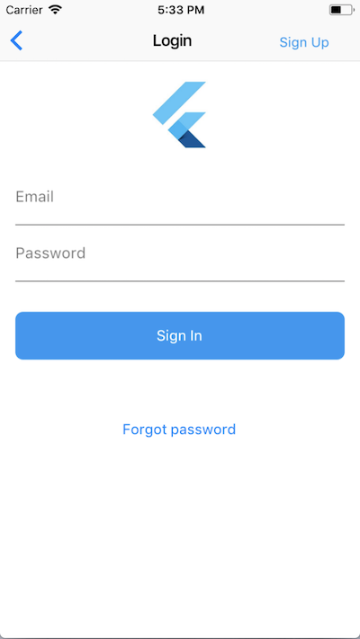

Sign In - ios

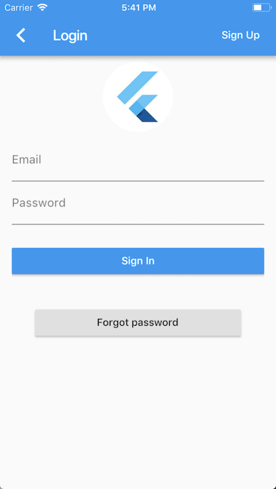

Sign In - android

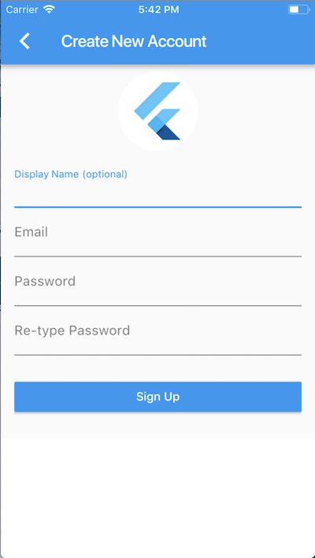

Sign up - android

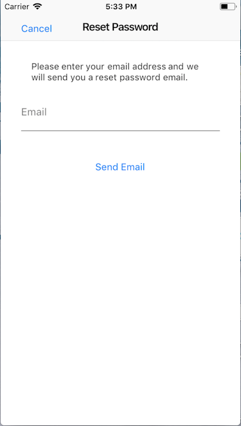

Reset password - ios

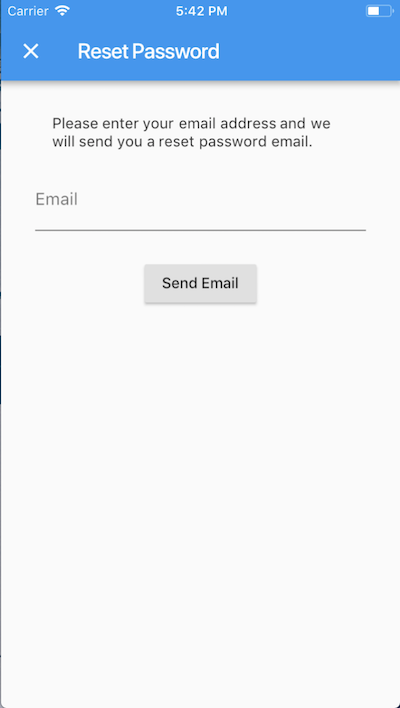

Reset password - android

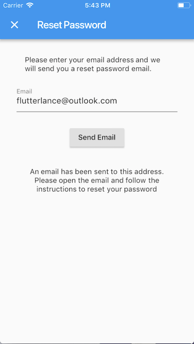

Reset password sent - android

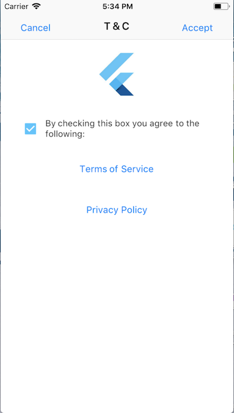

Terms Acceptance - ios

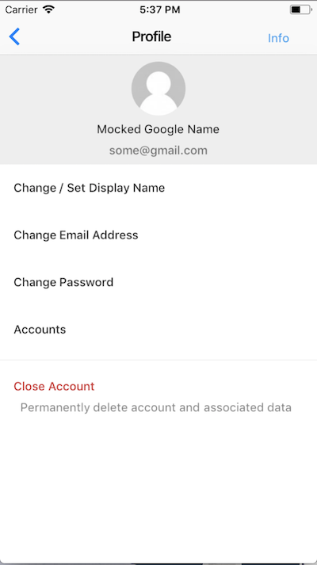

Profile account - ios

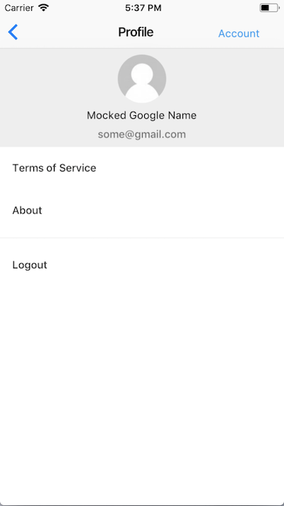

Profile info - ios

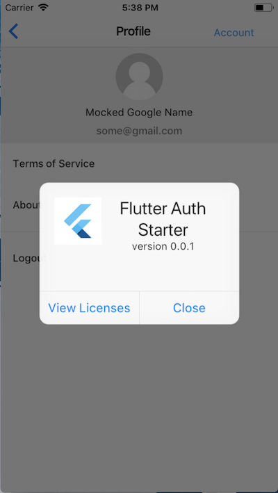

About - ios

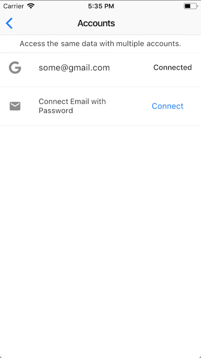

Link / Connect accounts - ios

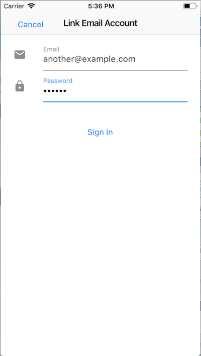

Link email - ios

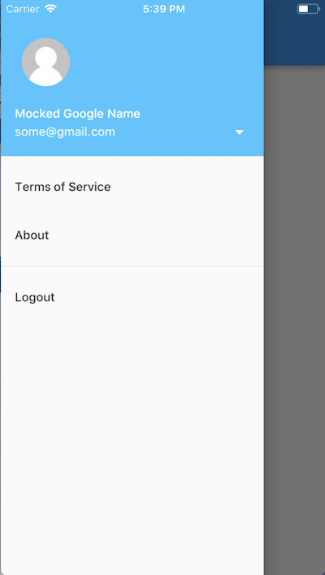

Drawer info - android

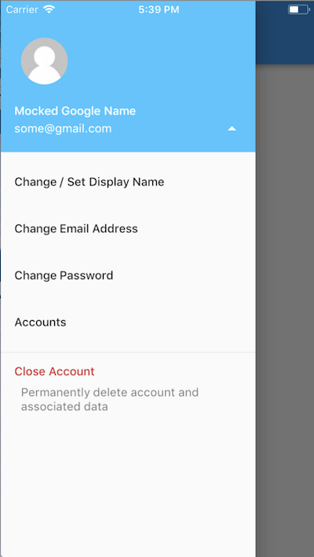

Drawer account - android

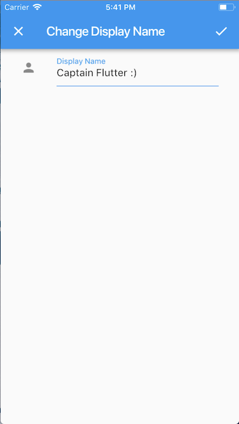

Change display name - android

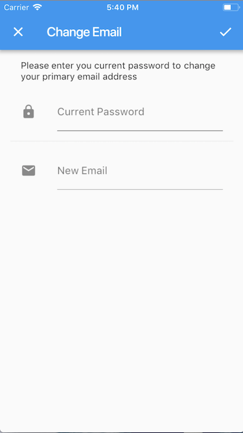

Change email - android

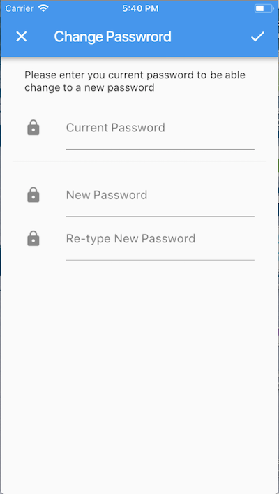

Change password - android
